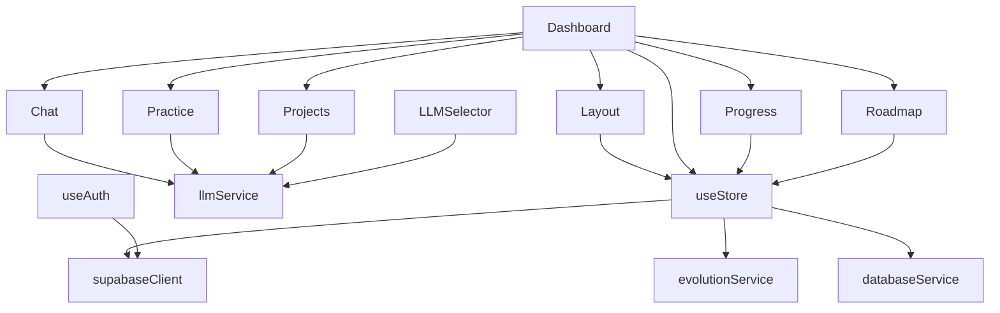

# TutorGPT Codebase Documentation

## Core Components

### Store Management
- **`src/store/useStore.ts`**
  - Central state management using Zustand
  - Manages user authentication, current mode, roadmaps, and progress
  - Connected to most components for state access
  - Interfaces with Supabase for data persistence
  - Used by: Layout.tsx, Dashboard.tsx, and most feature components

### Layout and Navigation
- **`src/components/Layout.tsx`**
  - Main application shell and navigation structure
  - Uses Mantine AppShell for layout
  - Manages navigation between different modes (Tutor, Roadmap, Practice, Projects, Progress)
  - Connected to useStore for mode management and user state
  - Parent component for all main features

### Main Features

#### Dashboard
- **`src/pages/Dashboard.tsx`**
  - Main container component that renders different modes
  - Switches between different feature views based on currentMode from useStore
  - Integrates with all feature components
  - Connected to: Layout.tsx, useStore.ts, and all feature components

#### Chat/Tutor Mode
- **`src/components/Chat.tsx`**
  - AI tutoring interface
  - Integrates with llmService for AI responses
  - Uses Markdown rendering for responses
  - Connected to: Dashboard.tsx, llmService.ts

#### Roadmap Feature
- **`src/components/Roadmap.tsx`**
  - Learning path visualization and management
  - Uses parseRoadmapContent for content structuring
  - Connected to: Dashboard.tsx, useStore.ts
  - Interfaces with databaseService for roadmap persistence

#### Practice Mode
- **`src/components/Practice.tsx`**
  - Quiz and practice question interface
  - Integrates with llmService for question generation
  - Tracks practice statistics and progress
  - Connected to: Dashboard.tsx, llmService.ts

#### Projects Feature
- **`src/components/Projects.tsx`**
  - Project suggestions and management
  - Integrates with llmService for project recommendations
  - Connected to: Dashboard.tsx, llmService.ts

#### Progress Tracking
- **`src/pages/Progress.tsx`**
  - Learning progress visualization
  - Calculates and displays progress metrics
  - Connected to: Dashboard.tsx, useStore.ts
  - Uses RoadmapMetrics from types/roadmap.ts

### Services

#### LLM Service
- **`src/services/llmService.ts`**
  - Handles AI model interactions
  - Supports multiple LLM providers (OpenAI, Groq, Anthropic)
  - Used by: Chat.tsx, Practice.tsx, Projects.tsx
  - Connected to: LLMSelector.tsx for model switching

#### Database Service
- **`src/services/databaseService.ts`**
  - Manages Supabase database interactions
  - Handles roadmap and progress data persistence
  - Used by: useStore.ts and feature components
  - Connected to: supabaseClient.ts

#### Evolution Service
- **`src/services/evolutionService.ts`**
  - Handles roadmap optimization and adaptation
  - Used by: useStore.ts for roadmap optimization
  - Connected to: types/roadmap.ts

### Authentication
- **`src/hooks/useAuth.ts`**
  - Authentication hook for Supabase
  - Manages user sessions and authentication state
  - Used by: Login.tsx, useStore.ts
  - Connected to: supabaseClient.ts

### Types and Interfaces
- **`src/types/roadmap.ts`**
  - Contains shared types for roadmaps and progress tracking
  - Used throughout the application for type safety
  - Connected to: useStore.ts, Progress.tsx, Roadmap.tsx

### Utility Components
- **`src/components/LLMSelector.tsx`**
  - Model selection interface
  - Connected to: Dashboard.tsx, llmService.ts
  - Manages AI model switching

## File Dependencies Graph



## Key Features and Their Files

1. **AI Tutoring**
   - Chat.tsx
   - llmService.ts
   - LLMSelector.tsx

2. **Learning Paths**
   - Roadmap.tsx
   - types/roadmap.ts
   - evolutionService.ts

3. **Practice System**
   - Practice.tsx
   - llmService.ts

4. **Project Suggestions**
   - Projects.tsx
   - llmService.ts

5. **Progress Tracking**
   - Progress.tsx
   - types/roadmap.ts
   - useStore.ts

## State Management Flow

1. **User Authentication**
   - Login.tsx → useAuth.ts → useStore.ts → supabaseClient.ts

2. **Learning Progress**
   - Progress.tsx → useStore.ts → databaseService.ts → supabaseClient.ts

3. **Roadmap Management**
   - Roadmap.tsx → useStore.ts → evolutionService.ts → databaseService.ts

4. **AI Interactions**
   - Feature Components → llmService.ts → External AI Providers

## Styling and UI
- Uses Mantine UI library for consistent styling
- AppShell from Mantine for layout structure
- Responsive design handled through Mantine components
- Icons from @tabler/icons-react 

    databaseService --> supabaseClient
```

### Data Flow
1. User interacts with a component
2. Component calls appropriate service
3. Service processes request (AI/database)
4. State updates via useStore
5. UI updates automatically

### File Organization
```
src/
├── components/          # UI Components
├── pages/              # Route Pages
├── services/           # Backend Services
├── store/              # State Management
├── hooks/              # Custom Hooks
├── types/              # TypeScript Types
└── lib/                # Utilities
``` 